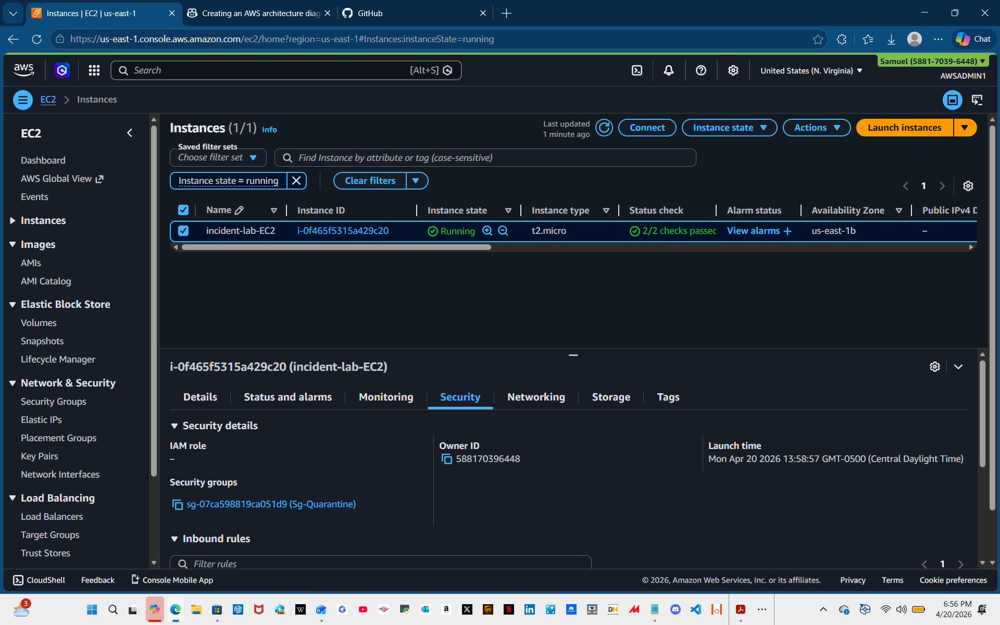
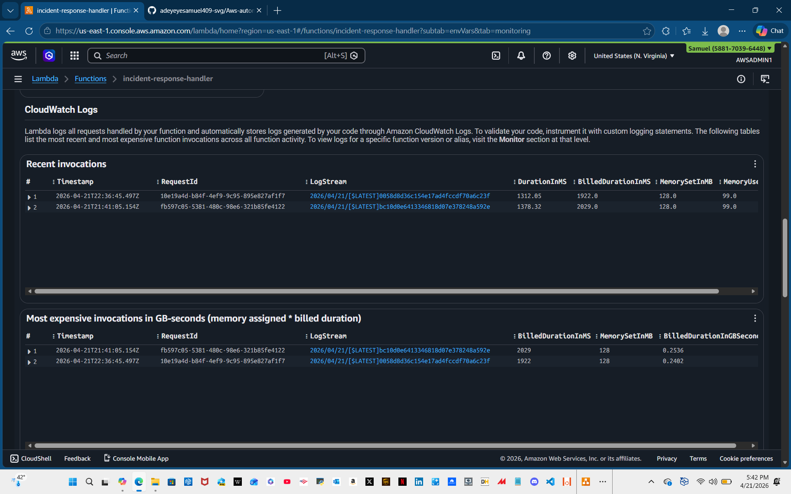
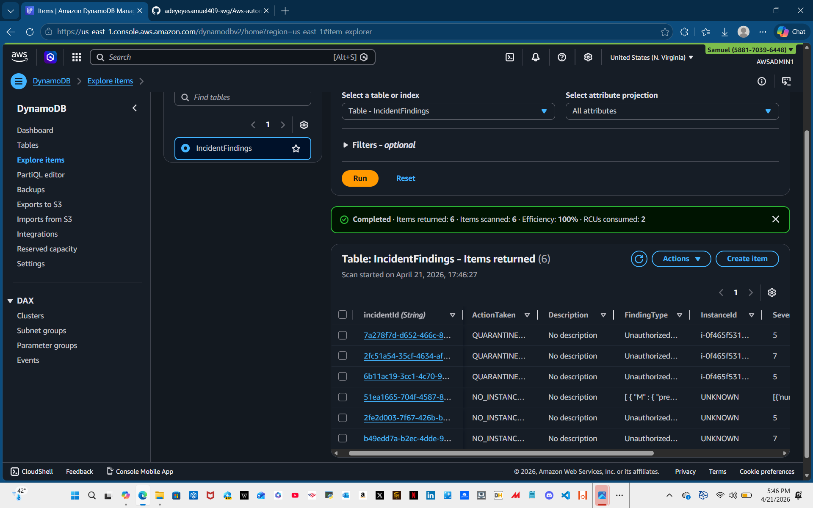
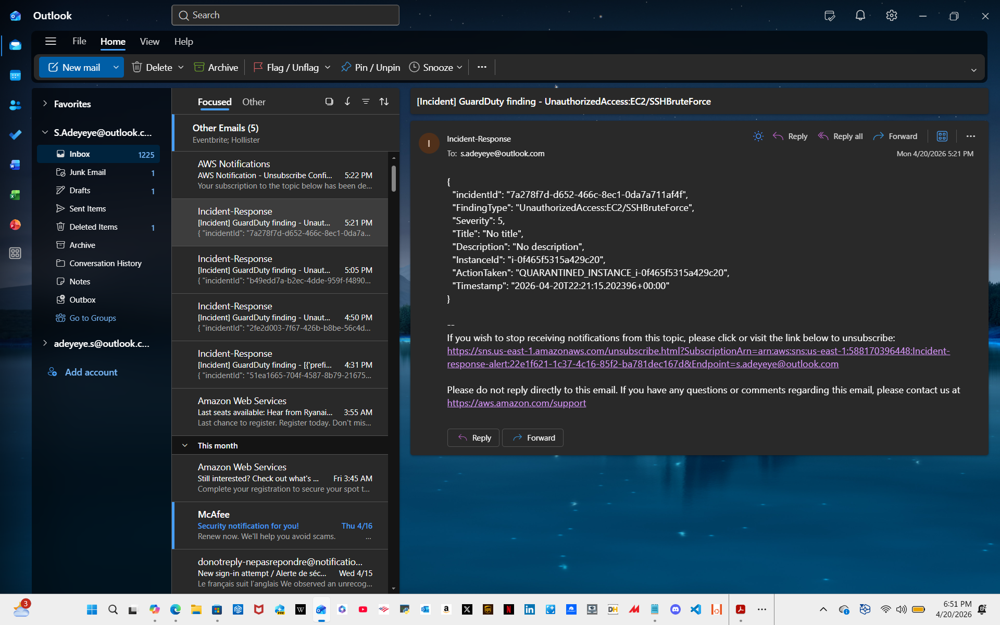
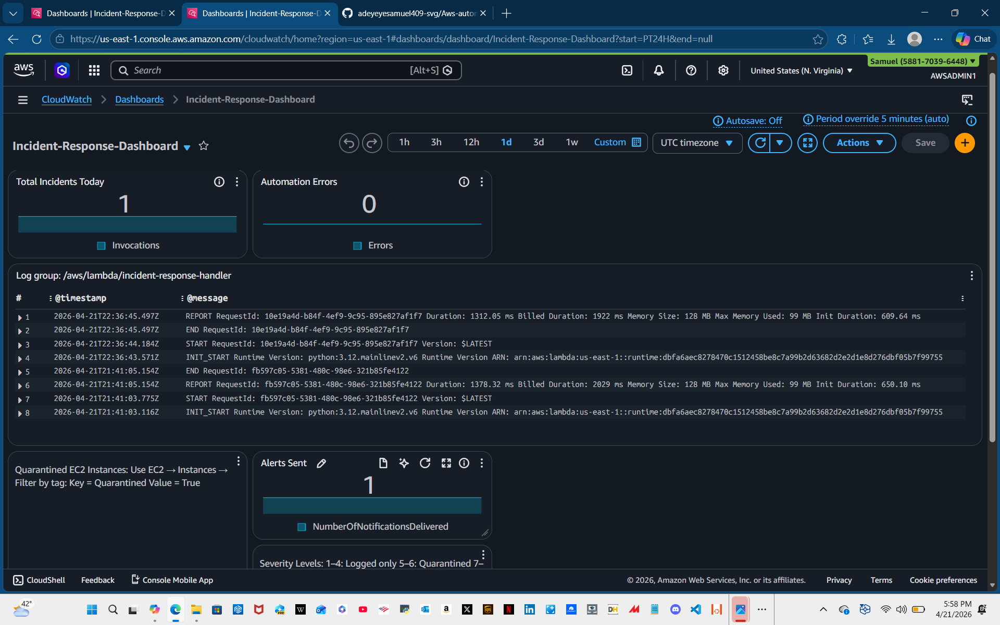
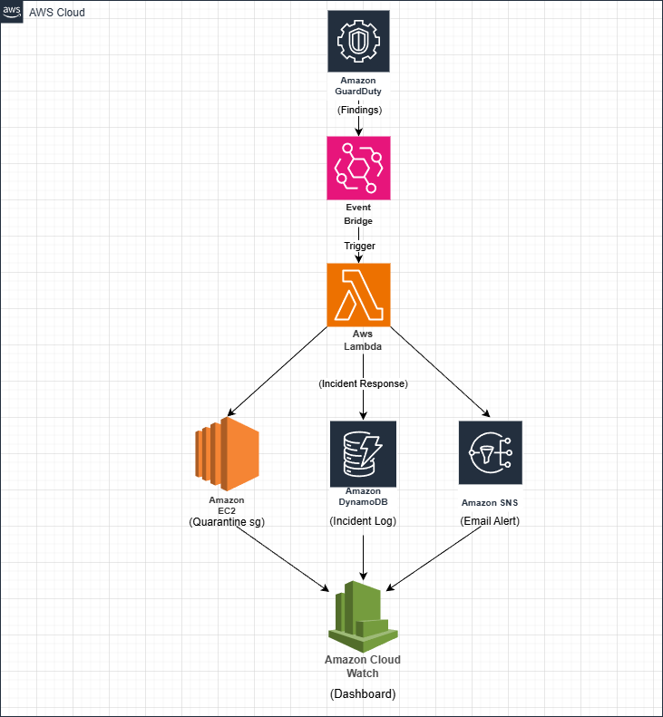

# Automated Incident Response on AWS

I built this project to explore how security automation works in the cloud.  
The idea was simple: if GuardDuty detects something suspicious on an EC2 instance, the system should react automatically, no waiting around for a human.

This setup now detects a finding, isolates the instance, logs the incident, and sends me an alert. All fully automated.

---

## What the system does

- Listens for GuardDuty findings (via EventBridge)
- Pulls out the affected EC2 instance ID
- Quarantines the instance by swapping its security group
- Logs the whole incident in DynamoDB
- Sends me an SNS email with the details
- Updates a CloudWatch dashboard so I can see everything in one place

It’s basically a mini SOC workflow running on AWS.

---

## Services involved

- **GuardDuty** – threat detection  
- **EventBridge** – triggers the automation  
- **Lambda** – the brains of the operation  
- **EC2** – the instance being quarantined  
- **DynamoDB** – incident history  
- **SNS** – alerting  
- **CloudWatch Dashboard** – monitoring  

---

## How it works 

1. GuardDuty reports a finding  
2. EventBridge sends it to Lambda  
3. Lambda grabs the instance ID  
4. The instance gets quarantined  
5. An incident record is written to DynamoDB  
6. SNS sends me an alert  
7. Dashboard updates automatically  

I tested it using a real EC2 instance, and the quarantine kicked in instantly.

---

## Why I built this

I wanted hands‑on experience with:
- Cloud security automation  
- Event‑driven architecture  
- Real‑time remediation  
- Logging and monitoring  
- Multi‑service AWS workflows  

This project ended up being a great way to tie all of that together.  

## Screenshots

### 1. Quarantined EC2 Instance

### 2. Lambda Execution Logs

### 3. DynamoDB Incident Record

### 4. SNS Alert Email

### 5. CloudWatch Dashboard

## Architecture Diagram

